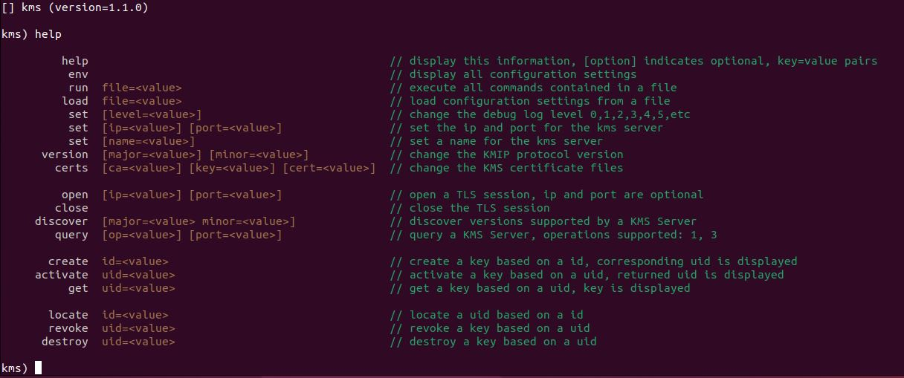
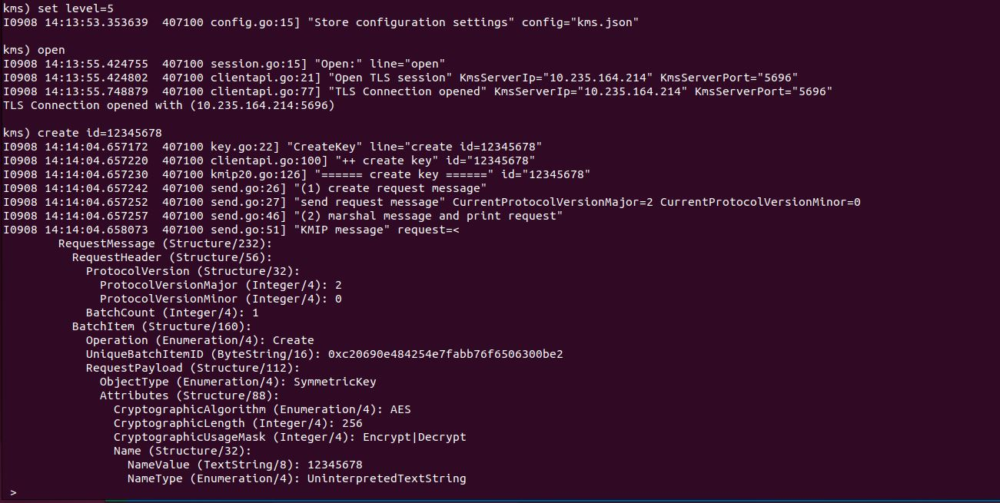

# Key Management System (KMS) Tool

#### Copyright (c) 2022 Seagate Technology LLC and/or its Affiliates

## Introduction

***kms*** is a command line tool to connect to a KMS Server and execute KMIP operations. This is an interactive tool
providing feedback both as console output as well ad multi-level logging using structured and contextual logging.

This tool provides:
- support for KMIP 1.4 and 2.0 versions
- variable configuration settings
- loading and storing json-file-based configuration settings
- executing open and close KMS server sessions
- executing create, activate, get, locate, revoke, and destroy key operations
- running a script file
- dynamic multi-level logging

## Table of Contents
* [(1) building kms](#section1)
* [(2) running kms](#section2)
* [(3) kms help](#section3)
* [(4) kms server](#section4)
* [(5) kms key operations](#section5)
* [(6) kms design](#section6)

## Roadmap

| Version | Notes                                                              |
| :------- | :---------------------------------------------------------------------- |
| 1.0.0     | First release |
| 1.1.0     | Add Discover and Query |
| 1.2.0     | Add ReKey |
| 1.3.0     | Handle command history, up arrow down arrow, back arrow, and forward arrow |
| 1.4.0     | Add Register |
| 1.5.0     | Add SetAttribute |


[//]: <> (================================================================================================================================================================)
## <a name="section1">(1) building kms</a>
[//]: <> (================================================================================================================================================================)

Building kms is performed from the kmip-go/cmd/kms folder. This requires `make` and `go` and `git` tools. The main option is to run `make local` which produces
a `kms` image that can be executed.

```
$ make

-----------------------------------------------------------------------------------
make clean        - remove all
make local        - build a local executable
make install      - install the executable
make run          - build a local executable and run it
```

```
$ make local
Clean up...
go clean
rm -f kms
Build local executable...
go build -o kms -ldflags "-X main.buildTime=`date -u '+%Y-%m-%dT%H:%M:%S'`"
ls -lh kms
-rwxrwxr-x 1 seagate seagate 7.8M Sep  8 16:14 kms
```

```
$ sudo make install
[sudo] password for seagate: 
Installing local executable...
install ./kms /usr/local/bin
```

[//]: <> (================================================================================================================================================================)
## <a name="section2">(2) running kms</a>
[//]: <> (================================================================================================================================================================)

It is suggested to run `kms` from a location where you can store configuration files that point to various KMS servers. Run `sudo make install` to add the executable
to your go path. For example, the following table describes a set of potential configuration files for a few KMS servers. Use the `kms) load file=<value>` option to load
those configuration settings. Once a session is opened, use `kms) help` to list commands and perform key operations.

| File               | Description                                                          |
| :----------------- | -------------------------------------------------------------------- |
| kms-pykmip.json    | Contains ip, port, and certificates for a PyKMIP KMS server          |
| kms-vault.json     | Contains ip, port, and certificates for a HashiCorp Vault KMS server |
| kms-vaultcore.json | Contains ip, port, and certificates for a Fornetix Vault KMS server  |


```
$ kms
[] kms (version=1.0.0)

kms) load file=kms-pykmip.json
configuration settings read from (kms-pykmip.json)

kms) env

           SettingsFile  kms-pykmip.json

             Connection  <nil>

          KmsServerName  pykmip
            KmsServerIp  10.235.164.214
          KmsServerPort  5696
           CertAuthFile  ./server/pykmip/lco-sw-pykmip.colo.seagate.com.crt
               CertFile  ./server/pykmip/client1.crt
                KeyFile  ./server/pykmip/client1.key

   ProtocolVersionMajor  2
   ProtocolVersionMinor  0
            ServiceType  kmip20

kms) open
TLS Connection opened with (10.235.164.214:5696)
```

[//]: <> (================================================================================================================================================================)
## <a name="section3">(3) kms help</a>
[//]: <> (================================================================================================================================================================)

Use `kms) help` to display all kms commands and associated options.




[//]: <> (================================================================================================================================================================)
## <a name="section4">(4) kms server</a>
[//]: <> (================================================================================================================================================================)

### open, version, set

The `open` command is used to attempt to establish a TLS connection with a KMS Server. Use `kms) env` to display current settings and the following commands to update
KMS server settings. Once your settings are correct using `set` commands, or the `load` command, use `open` to establish a KMS server connection. A valid connection is
required to perform KMIP key operations.

- `set ip=<value> port=<value>`
- `set name=<value>`
- `version major=2 minor=0`
- `certs ca=<value> key=<value> cert=<value>`

```
kms) set name=pykmip
KmsServerName set to: pykmip

kms) set ip=10.235.164.214 port=5696
KmsServerIp set to: 10.235.164.214
KmsServerPort set to: 5696

kms) version major=2 minor=0
kmip protocol version 2.0

kms) certs ca=./server/pykmip/lco-sw-pykmip.colo.seagate.com.crt key=./server/pykmip/client1.key cert=./server/pykmip/client1.crt
CertAuthFile set to: ./server/pykmip/lco-sw-pykmip.colo.seagate.com.crt
KeyFile set to: ./server/pykmip/client1.key
CertFile set to: ./server/pykmip/client1.crt

kms) open
TLS Connection opened with (10.235.164.214:5696)
```

### discover

Use the `discover` command to discover one or more KMIP protocol versions supported by a KMS server. If no major/minor version is 
specified, all supported versions are returned by the KMS server. If a single version is provided, then the server either returns
that version as supported, or returns an empty list.

#### KMS Server 1 Testing

```
kms) open
TLS Connection opened with (10.235.164.214:5696)

kms) discover
Discover results: [{2 0} {1 4} {1 3} {1 2} {1 1} {1 0}]

kms) discover major=1 minor=2
Discover results: [{1 2}]

kms) discover major=2 minor=0
Discover results: [{2 0}]
```

#### KMS Server 2 Testing

```
kms) open
TLS Connection opened with (10.235.164.211:5696)

kms) discover
Discover results: [{1 4} {1 3} {1 2} {1 1} {1 0}]

kms) discover major=1 minor=2
Discover results: [{1 2}]

kms) discover major=1 minor=5
Discover results: []
```

### query

Use the `query` command to extract information from a KMS Server.

```
kms) open
TLS Connection opened with (10.235.164.211:5696)

kms) query op=1
Query results: {
    "Operation": [
        "Query",
        "Locate",
        "Destroy",
        "Get",
        "Create",
        "Register",
        "GetAttributes",
        "GetAttributeList",
        "AddAttribute",
        "ModifyAttribute",
        "DeleteAttribute",
        "Activate",
        "Revoke",
        "Poll",
        "Cancel",
        "Check",
        "GetUsageAllocation",
        "CreateKeyPair",
        "ReKey",
        "Archive",
        "Recover",
        "ObtainLease",
        "ReKeyKeyPair",
        "Certify",
        "ReCertify",
        "DiscoverVersions",
        "Notify",
        "Put",
        "RNGRetrieve",
        "RNGSeed",
        "Encrypt",
        "Decrypt",
        "Sign",
        "SignatureVerify",
        "MAC",
        "MACVerify",
        "Hash",
        "CreateSplitKey",
        "JoinSplitKey",
        "DeriveKey"
    ]
}

kms) query op=3
Query results: {
    "Vendor Identification": "Fornetix"
}
```

[//]: <> (================================================================================================================================================================)
## <a name="section5">(5) kms key operations</a>
[//]: <> (================================================================================================================================================================)

The main purpose of the `kms` tool is to execute KMIP commands using a networked KMS server. This tool can be used to test existing commands or to debug new commands.


Debugging is accomplished by turning up the logging level. Use `kms) set level=<value>` to set the logging level.




[//]: <> (================================================================================================================================================================)
## <a name="section6">(6) kms design</a>
[//]: <> (================================================================================================================================================================)

The `kms` tool is built using a fairly straightforward design. The main program uses handlers to link command line strings to functions. Each single word command is
linked to a function. The main user interface is in the handlers, which is expected to print text to the console so the user can view results.

At the a lower level of the design is the KMIP API, which has a high level interface with instantiations for KMIP 1.4 and KMIP 2.0 commands. More versions can be added withoput changing.
The `kms` use sets the KMIP protocol version using ``version major=<value? minor=<value>` which in turns sets a string to kmip14 or kmip20 and is used to retrieve the correct
instantiation of the interface based on version. Each version of the KMIP commands are stored in separate files: kmip14.go and kmip20.go. At this level, the design is to only
return errors and let the higher level user interface print messages. Logging is implemented at this level to add additional debug when the level is 2 or greater.

`cmd/kms/main.go`:
- The main program.
- Initializes and processes flags and creates a context.
- Initializes a map of function pointers called handlers.
- Reads `kms.json` if it exists and stores all configuration settings in this file.
- Then creates a `kms)` prompt and scans user input.
- For each command entered after `kms) `, the handlers.Execute() is called passing in the context, settings, and the input text line.

`src/common`:
- `config.go` to **Store** and **Restore** the configuration settings file.
- `parsers.go` to handle parsing **key=value** pairs from the command line string.
- `types.go` to store common types such as **ConfigurationSettings**.

`src/handlers`:
- The `handlers.go` file initializes a map of function pointers. All functions must take the same arguments.
- Update `g_handlers` to add a new row which is a command string and function pointer.
- The `Execute()` does not require changes.
- `env.go` to execute environmental commands.
- `help.go` to display help for commands. This needs to be updated when a new command is added.
- `key.go` to execute KMIP key related operations such as create, activate, get, locate, revoke, destroy.
- `server.go` to execute KMS server operations to open and close a session.

`src/kmipapi`:
- A Go interface to executing various versions of KMIP commands.
- `kmipservice.go` is used to extract a pointer the correct KMIP protocol version instantiation.
- `clientops.go` contains the Request and Response message definitions for all KMIP operations.
- `clientapi.go` contains all of the KMS and KMIP functions needed for KMIP operations. These are called by the handlers.
- `send.go` provides a common SendRequestMessage function used by all version.
- `kmip14.go` provides KMIP 1.4 version commands, the actual code for the interface
- `kmip20.go` provides KMIP 2.0 version commands, the actual code for the interface
